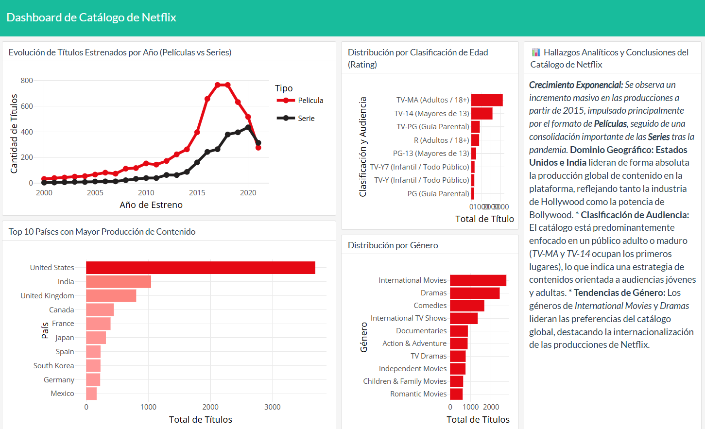

# 🎬 Dashboard Interactivo del Catálogo de Netflix

Este proyecto presenta un tablero analítico e interactivo desarrollado en **R** utilizando `flexdashboard`, `tidyverse`, `plotly` y `crosstalk`. Su objetivo principal es explorar, filtrar y visualizar las principales dinámicas del catálogo histórico de la plataforma de streaming Netflix (películas y series) bajo un enfoque de ciencia de datos y visualización ejecutiva.

---

## 📊 Vista Previa del Tablero

---

## 🚀 Características Principales
* **Filtros Globales Dinámicos:** Permite alternar y segmentar todo el tablero en tiempo real entre películas y series.
* **Análisis Temporal:** Evolución histórica de estrenos a partir del año 2000.
* **Distribución Geográfica:** Top de países con mayor producción de contenido global.
* **Clasificación de Audiencias:** Ratings de edad enriquecidos con descripciones claras en español.
* **Buscador Interactivo:** Tabla integrada con paginación, filtros y desplazamiento optimizado mediante `DT`.
